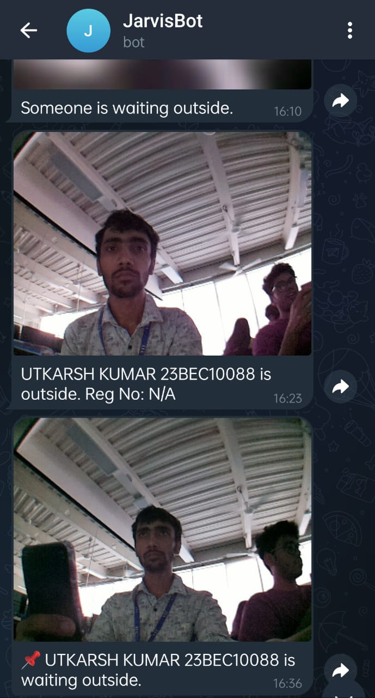
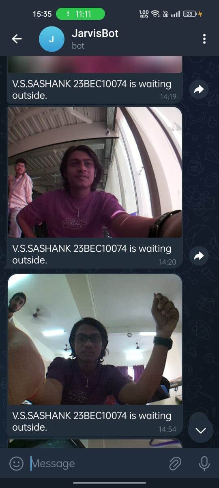
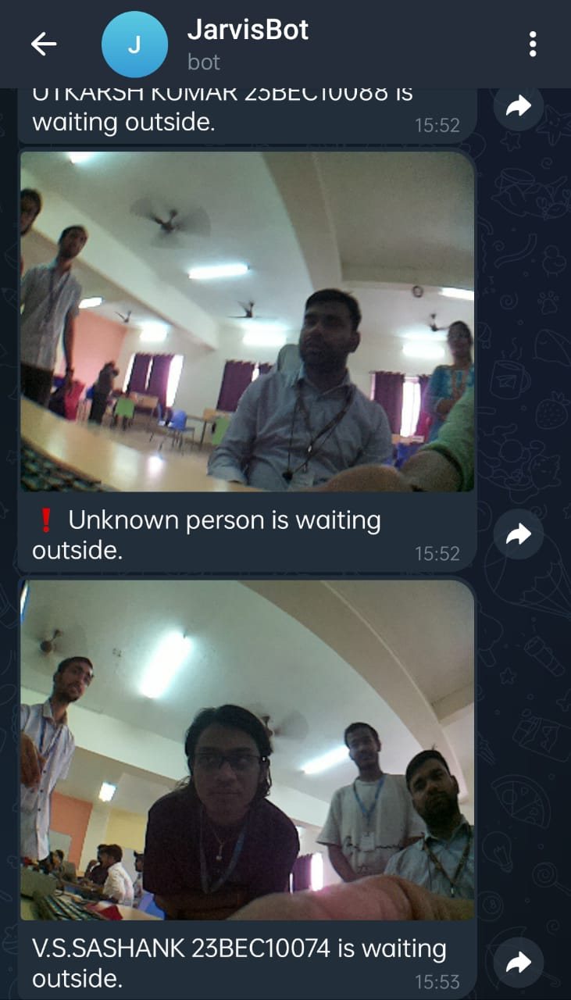

# 🔍 FaceRecognitionSystem

A Raspberry Pi–based intelligent face recognition system with:
- Real-time face detection using camera
- IR sensor–triggered activation
- Buzzer alert for unknown individuals
- Notification and image capture via Telegram bot (**JarvisBot**)
- Trainable dataset for custom users

---

## 📚 Table of Contents
- [Features](#-features)
- [Hardware Requirements](#-hardware-requirements)
- [Raspberry Pi Setup](#-raspberry-pi-setup)
- [Wi-Fi Setup](#-wi-fi-setup)
- [Project Structure](#-project-structure)
- [System Workflow](#-system-workflow)
- [Telegram Bot Notifications – Real Chat Examples](#-telegram-bot-notifications--real-chat-examples)
- [Dataset Folder Format](#-dataset-folder-format)
- [Step 1: Create Dataset](#-step-1-create-dataset)
- [Step 2: Train the Model](#-step-2-train-the-model)
- [Step 3: Run Recognition](#-step-3-run-recognition)
- [Telegram Bot Setup](#-telegram-bot-setup)
- [GPIO Pin Mapping](#-gpio-pin-mapping)
- [Applications](#-applications)
- [To Do](#-to-do)
- [License](#-license)
- [Contact](#-contact)

---

## ✨ Features

- Live face detection using PiCamera
- Custom person dataset creation
- Recognition powered by face_recognition library
- IR sensor triggers the process
- Sends photo and recognition result to Telegram bot (**JarvisBot**)
- Buzzer activates if face is unknown

---

## 🛠 Hardware Requirements

- Raspberry Pi (recommended: Pi 4)
- PiCamera
- IR Sensor (GPIO 17)
- Buzzer (GPIO 24)
- Optional: Relay for door unlock (GPIO 14)
- Breadboard and jumper wires
- Internet (Wi-Fi)

---

## ⚙️ Raspberry Pi Setup

1. Flash Raspberry Pi OS to your SD card using the Raspberry Pi Imager
2. Insert card into Raspberry Pi and boot
3. Enable:
   - Camera Interface
   - SSH (optional)
   - I2C (optional)
   via raspi-config:
   ```bash
   sudo raspi-config
   ```
4. Update packages:
   ```bash
   sudo apt update && sudo apt upgrade
   sudo apt install python3-pip libatlas-base-dev libopenjp2-7 libtiff5
   pip install -r requirements.txt
   ```

---

## 📶 Wi-Fi Setup

### ✅ 1️⃣ Desktop (GUI)
- Click the **Wi-Fi icon** on the taskbar
- Select your **network**
- Enter **password** and connect

### ✅ 2️⃣ Terminal with raspi-config
```bash
sudo raspi-config
# Go to: 1 System Options → S1 Wireless LAN
# Enter SSID and Password
sudo reboot
```

### ✅ 3️⃣ Headless Setup (no monitor)
On your SD card (boot partition), add a file called `wpa_supplicant.conf`:
```conf
country=IN
ctrl_interface=DIR=/var/run/wpa_supplicant GROUP=netdev
update_config=1

network={
    ssid="YourWiFiNetwork"
    psk="YourWiFiPassword"
}
```
Also create an empty file named `ssh` to enable SSH. Boot the Pi and it will auto-connect.

---

## 📁 Project Structure

```
FaceRecognitionSystem/
├── facial_recognition.py
├── facial_recognition_hardware.py
├── image_capture.py
├── model_training.py
├── dataset/
├── encodings.pickle
├── requirements.txt
├── images/
│   ├── utkarsh_detected.jpg
│   ├── sashank_detected.jpg
│   └── unknown_detected.jpg
└── README.md
```

---

## 🎯 System Workflow

1️⃣ IR sensor detects motion at the door  
2️⃣ Camera activates and captures an image  
3️⃣ Captured image is compared with trained face encodings  
4️⃣ Decision:
- ✅ If **known** → Name and Reg No. are sent to Telegram
- ⚠️ If **unknown** → Buzzer activates and alert is sent

All notifications are delivered through the custom Telegram bot named **JarvisBot**.

---

## 📸 Telegram Bot Notifications – Real Chat Examples

JarvisBot automatically sends the captured images with a clear message.

### ✅ Known Person: Utkarsh

> “UTKARSH KUMAR 23BEC10088 is waiting outside.”



---

### ✅ Known Person: Sashank

> “V.S.SASHANK 23BEC10074 is waiting outside.”



---

### ⚠️ Unknown Person

> “❗ Unknown person is waiting outside.”



---

## 🗂️ Dataset Folder Format

Your dataset should be organized as:

```
dataset/
├── UTKARSH KUMAR 23BEC10088/
│   ├── image_1.jpg
│   └── image_2.jpg
├── V.S.SASHANK 23BEC10074/
│   ├── image_1.jpg
│   └── image_2.jpg
```

---

## 📸 Step 1: Create Dataset

Edit `PERSON_NAME` in `image_capture.py`:

```python
PERSON_NAME = "utkarsh"
```

Run:
```bash
python image_capture.py
```
Press **Space** to capture images. Press **q** to quit.  
Images saved in `dataset/PERSON_NAME/`.

---

## 🧠 Step 2: Train the Model

After collecting images for all users:

```bash
python model_training.py
```
This will generate `encodings.pickle` for recognition.

---

## 🔍 Step 3: Run Recognition

Run the full system with IR sensor, buzzer, and Telegram integration:

```bash
python facial_recognition_hardware.py
```

---

## 🤖 Telegram Bot Setup

1. Chat with [@BotFather](https://t.me/BotFather) on Telegram
2. Create a new bot using `/newbot`
3. Name your bot (e.g. **JarvisBot**)
4. Copy the **Bot Token** provided
5. Start your bot by searching for it in Telegram and pressing "Start"
6. Get your chat ID by visiting:
```
https://api.telegram.org/bot<YOUR_TOKEN>/getUpdates
```
7. In `facial_recognition_hardware.py`:

```python
BOT_TOKEN = "YOUR_BOT_TOKEN"
CHAT_ID = "YOUR_CHAT_ID"
```

---

## 🧬 GPIO Pin Mapping

| Component      | GPIO Pin |
|-----------------|----------|
| IR Sensor       | GPIO 17  |
| Buzzer          | GPIO 24  |
| Door Unlock     | GPIO 14  |

---

## 💡 Applications

- Smart home door access
- Hostel/PG visitor management
- College attendance system
- Office visitor logging

---

## ✅ To Do

- [ ] Cloud logging integration
- [ ] Web interface for dataset management
- [ ] GUI for adding new faces

---

## 📜 License

MIT License

---

## 👤 Author

Utkarsh Jha  
GitHub: [@Utkarshjha09](https://github.com/Utkarshjha09)
